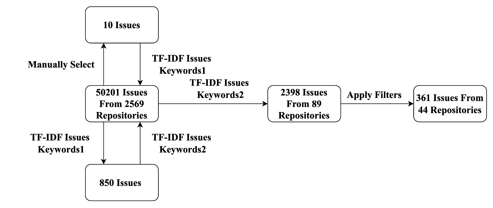
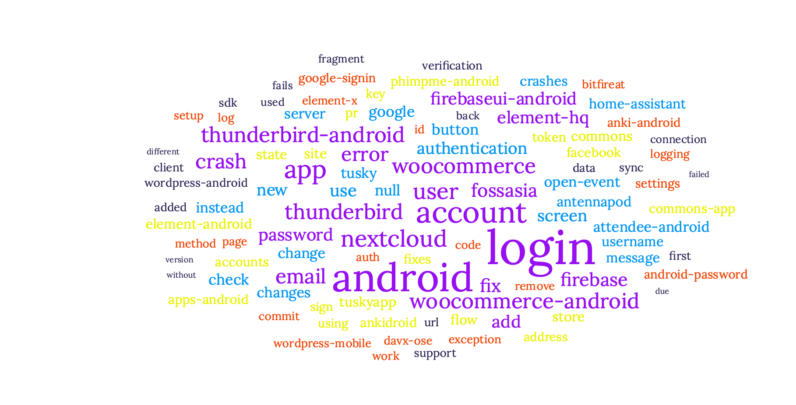
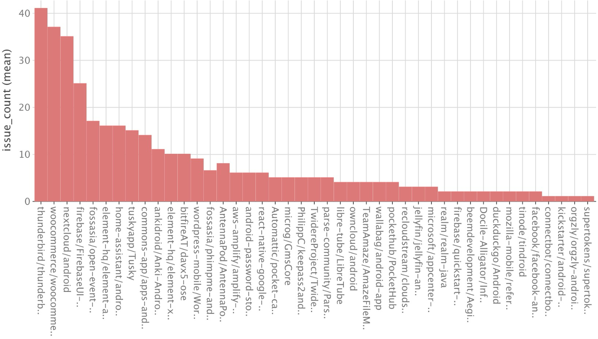
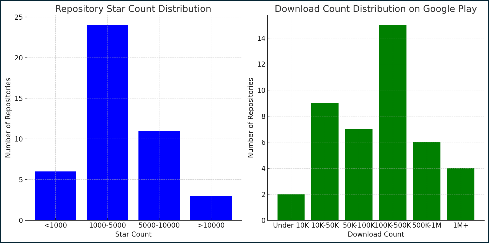
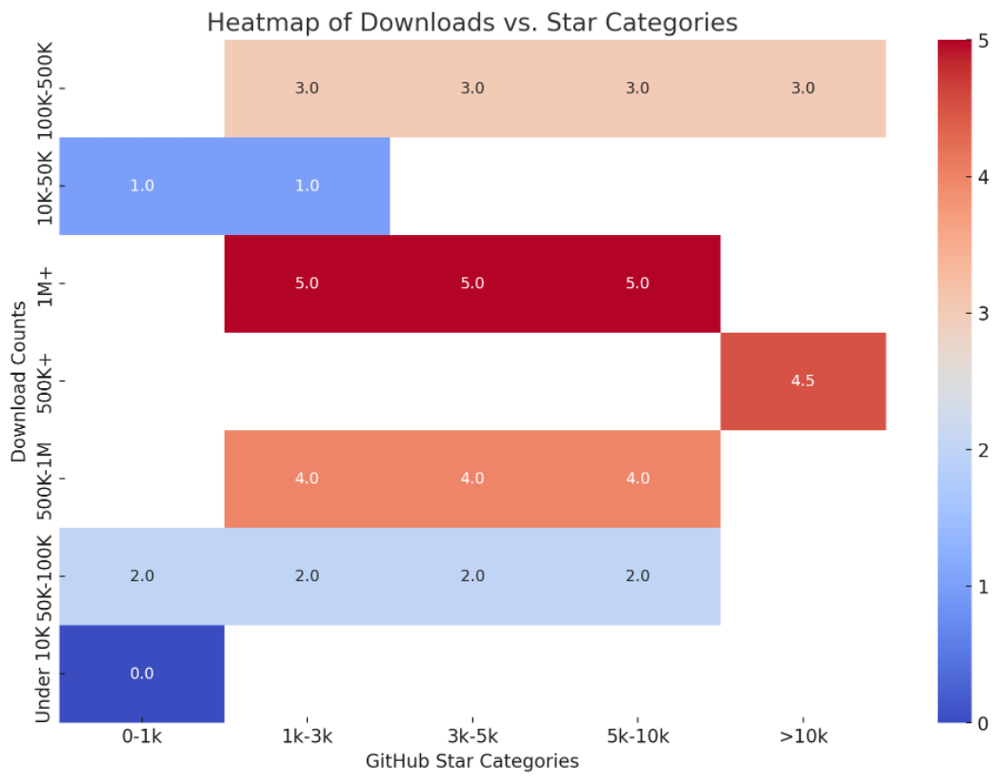
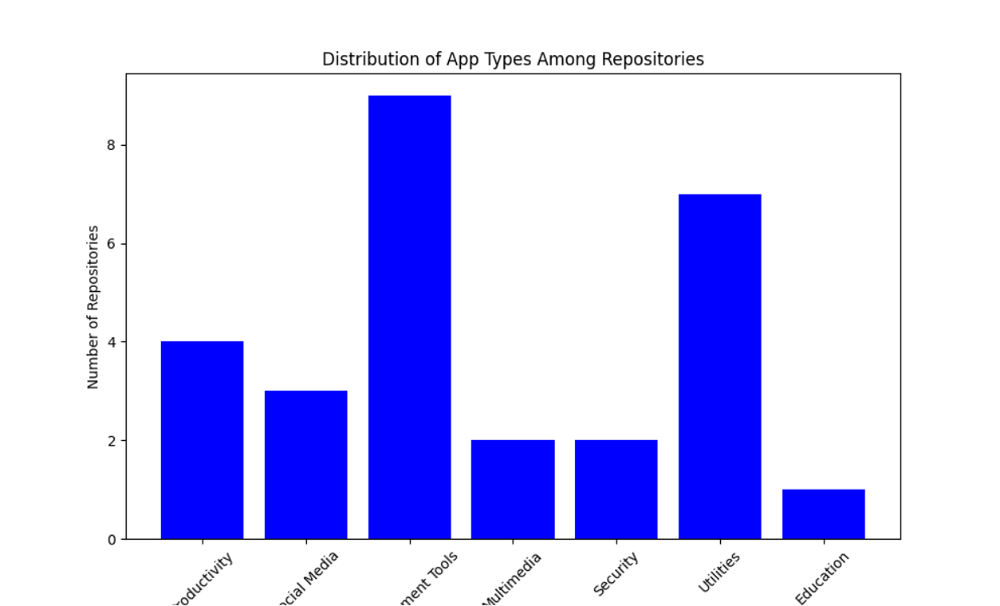
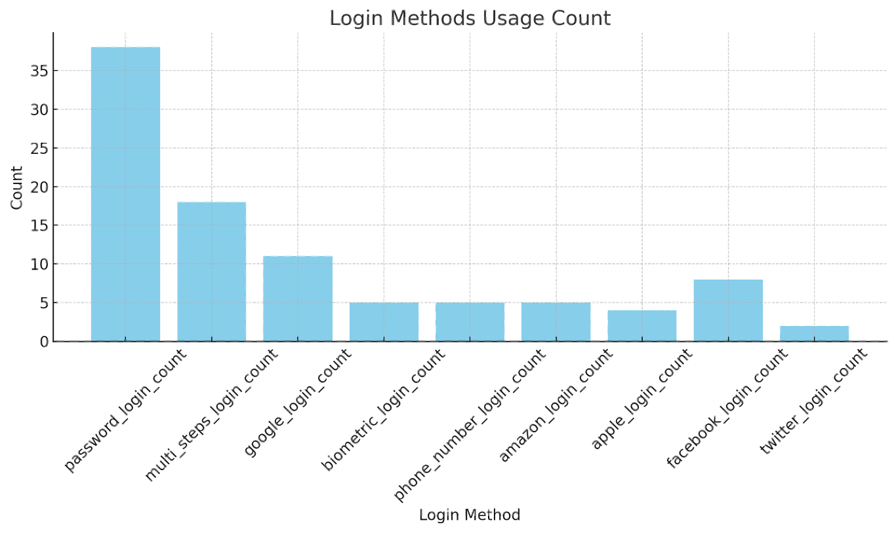

# Android-Login-Analysis

This dataset is licensed under the GPL-3.0 license.

- [Android-Login-Analysis](#android-login-analysis)
  - [Motivation](#motivation)
  - [Data Collection](#data-collection)
    - [Structure](#structure)
    - [Selection Process](#selection-process)
      - [Searching Repositories by Topic](#searching-repositories-by-topic)
      - [Filtering "Guide" Repositories](#filtering--guide--repositories)
    - [Extraction Process](#extraction-process)
      - [Searching for Issues](#searching-for-issues)
      - [TF-IDF Analysis](#tf-idf-analysis)
  - [Data Provision](#data-provision)
    - [Raw Dataset (Selection Process)](#raw-dataset--selection-process-)
    - [Refined Dataset (Extraction Process)](#refined-dataset--extraction-process-)
  - [Description of Refined Dataset](#description-of-refined-dataset)
    - [**Dataset Overview**](#--dataset-overview--)
    - [**Data Distribution**](#--data-distribution--)
      - [Repository Stars](#repository-stars)
      - [App Downloads](#app-downloads)
      - [Analysis of Popularity](#analysis-of-popularity)
      - [Insights from the Heatmap](#insights-from-the-heatmap)
      - [Conclusion](#conclusion)
    - [**App Types**](#--app-types--)
    - [**Login Methods Coverage**](#--login-methods-coverage--)
  - [References](#references)

The TOC is generated by GitHub Wiki TOC generator[^4]

## Motivation

Login plays a critical role in Android apps, typically representing the first point of interaction between the application and the users. Studies have shown that first-time login failures can lead to a direct and immediate drop in user engagement by as much as 25\%.[^1]

Some studies analyze vulnerabilities related to Android app authentication, an important component in the login process. Shi et al. [^2] developed MoSSOT, a backbox tester for OAuth process in Android. Furthermore, Tamjid et al. [^3] conducted an empirical study on the usage of OAuth APIs and their implications for mobile security, leading to the development of OAUTHLINT, a tool to identify vulnerabilities in OAuth implementations for Android apps. These studies mainly focused on vulnerabilities arising from the authentication process.
However, the login process extends beyond authentication.

As a result, developing reliable and robust login processes requires the app developers to properly manage complicated interactions between the app, the users and the servers.
And there is no dataset or research focused on this process.

We carried out the dataset on login problems within real-world Android apps. Our dataset includes 361 login issues sourced from 44 widely-used repositories. We have made this dataset available to support further research.

The structure of the repository is two parts, the first part is about data collection and dataset provision.

## Data Collection

This directory contains various scripts and input/output files related to the data collection phase of the project. Below is a breakdown of each component and its purpose.

### Structure

- **/input**: Contains seed files for initiating searches.
  - `repos_filter.txt`: List of repositories to be filtered.
  - `repos_topics.txt`: List of topics for repository search.
  - `snowballing_keywords.txt`: Keywords for extending searches via snowballing.

- **/models**: Directory for github realted models such as repository,issues(not detailed here).

- **/util**: Utility scripts for processing data.
  - `dependencies.go`: Manages dependencies for Go scripts.
  - `filter.py`: Python script for filtering data.
  - `issues.go`: Go script to fetch issues from GitHub.
  - `output.go`: Manages output operations for Go scripts.
  - `read.go`: Reads data inputs.
  - `repositories.go`: Fetches repository data.
  - `search.go`: Script to search for repositories or issues.
  - `snowballing.py`: Extends searches based on new keywords found.
  - `tfidf.go`: Processes TF-IDF calculations.
  - `words_count.go`: Counts words in provided texts.
  - `go.mod` and `go.sum`: Go module files for managing dependencies.
  - `main.go`: Main execution script for the Go application.

### Selection Process

The propose of selection process is to get all repositories that is related to Android apps. And then we want to filter repositories that is only about leetcode or some framework handbook.

#### Searching Repositories by Topic

1. Add topics to `input/repos_topics.txt`.
2. Run the `main` function in `main.go` script.
3. Insert your GitHub token when prompted to authenticate API requests.
4. Results are saved in `output/searched_repos.txt`. And we get 2675 repositories.

#### Filtering "Guide" Repositories

1. Define filter keywords in `input/repos_filter.txt`.
2. Run the `filter.py` script with these keywords.
3. Results are saved in `output/repos_keywords_filter.txt`. We get 2569 repositories after this step.

### Extraction Process

Through the previous selection process, we obtained **2,569 repositories**. First, we collected all the issues from these repositories, resulting in a total of **50,201 issues**.

During the extraction process, we aimed to identify login-related issues from this dataset. To achieve this, we applied the **TF-IDF algorithm** to extract keywords, which were then used for matching. This approach narrowed the dataset down to **2,398 issues**.

Next, we filtered these issues based on the following criteria:

1. **Fix Commit Link**  
   Each issue must include a link to a commit, indicating that developers addressed and resolved the issue.  

2. **Accessibility of Commit Links**  
   The commit links must be accessible to allow for a review of the actual code changes.

After applying these filtering criteria, we identified a final set of **361 issues**.
The process was shown in this figure:

#### Searching for Issues

1. Run the `issues.go` script to fetch issues based on predefined criteria.
2. Results are stored in `output/GuthbIssues.txt`.

#### TF-IDF Analysis

1. Source code for the TF-IDF computations is located in `util/tfidf.go`.
2. We choose top 100 TF-IDF keywords, the wordcloud is shown below:

## Data Provision

Our dataset is divided into two parts: **Raw Dataset** and **Refined Dataset**. Their structures are as follows:

### Raw Dataset (Selection Process)

This dataset includes all intermediate files generated during the selection and keyword extraction process. It provides detailed insights into how repositories and issues were filtered and processed. The structure is:

- **`GuthbIssues.txt`**: Contains the raw issues extracted from GitHub repositories before any processing.
- **`repos_keywords_filter.txt`**: A file listing repositories filtered based on keyword matches.
- **`searched_repos.txt`**: Contains repositories identified during the initial selection process.
- **`TF_IDF_body.txt`**: The body content of issues processed through the TF-IDF algorithm.
- **`TF_IDF.txt`**: Keywords generated using the TF-IDF algorithm.
- **`words_count_body.txt`**: Word counts from the body of issues for keyword extraction.
- **`words_count.txt`**: Word counts from the entire dataset used to refine keywords.

### Refined Dataset (Extraction Process)

This dataset includes the final, processed data after applying the selection and filtering criteria. The structure is:

- **`t_issues.csv`**: A CSV file containing the refined list of login-related issues with all relevant metadata.
- **`t_issues.sql`**: A SQL-compatible file storing the refined issues data for database operations.
- **`t_repos.csv`**: A CSV file containing repository metadata related to the refined issues.
- **`t_repos.sql`**: A SQL-compatible file storing repository metadata for database queries.

Both datasets follow a clear hierarchy to separate the raw data used in processing from the finalized, ready-to-use data for analysis. Let me know if you'd like more details on file contents or specific columns!

## Description of Refined Dataset

The **Refined Dataset** contains the final processed data, carefully curated and structured to support analysis and insights into login-related issues. Below are the key elements of the refined dataset:

### **Dataset Overview**

- Contains **361 issues** extracted from **44 repositories**.
- Focused on identifying and analyzing login-related problems in Android open-source applications.
- Includes metadata about repositories and issues, ensuring traceability and context.

  

### **Data Distribution**

#### Repository Stars

The dataset includes repositories of varying popularity, categorized by star counts:

- `<1000`
- `1000–5000`
- `5000–10000`
- `>10000`

These categories reflect the diversity in app usage and developer interest.

#### App Downloads

The dataset also captures download counts on Google Play, categorized as:

- `Under 10K`
- `10K–50K`
- `50K–100K`
- `500K–1M`
- `1M+`

These categories indicate the app's adoption rate.

---

#### Analysis of Popularity

From the analysis of **Google Play download counts** and **GitHub star categories**, we observed the following:

1. **General Observation**
   - Most repositories are either popular among **users** (indicated by high download counts) or **developers** (indicated by high star counts).
   - However, this leads to the question:  
     **Do any repositories excel in both user popularity and developer interest?**

2. **Answering the Question**
   To address this, we created a **heatmap** to show the relationship between download counts and star categories.

#### Insights from the Heatmap

1. **Patterns Identified**:
   - Repositories with **high download counts (1M+ or 500K–1M)** often have moderate to high GitHub star counts (e.g., `3K–5K`, `>10K`).
   - Repositories with **high GitHub stars (>10K)** tend to correlate with higher download counts on Google Play, reflecting interest from both developers and users.

2. **Overlap in Popularity**:
   - A small subset of repositories stands out in both dimensions, having:
     - **High download counts (1M+)**
     - **Significant GitHub star counts (>5K)**
   - These repositories are well-received by both users and developers, indicating strong functionality and active community support.

---

#### Conclusion

This heatmap provides a clear visualization of the intersection between **user adoption** and **developer interest**, helping to identify standout repositories that meet both criteria.

### **App Types**

- The dataset spans various app categories, such as social media, productivity, tools, entertainment, and education, offering a broad spectrum of app functionalities.
  

### **Login Methods Coverage**

- Analyzes the types of login methods used across apps, such as:
  - Password-based login
  - Multi-factor authentication
  - Google/Facebook/Apple login
  - Biometric authentication (e.g., fingerprint, face ID)
  - Other custom login methods

This refined dataset provides a well-rounded foundation for further analysis, allowing researchers and practitioners to explore patterns, root causes, and solutions for login-related issues in Android apps. Let me know if you'd like help formatting this into a report or README file!

## References

[^1]: N. Bozovic. (2023) First-time user experience (ftue): Why it matters how to improve it. [Online]. Available: <https://www.chameleon.io/blog/first-time-user-experience>

[^2]:S. McElroy, “[Identifying android banking malware through measurement of user interface complexity](https://ieeexplore.ieee.org/document/10679403),” in CSR, 2024, pp. 348–353
[^3]:T. A. Rahat, Y. Feng, and Y. Tian, “[Oauthlint: An empirical study on oauth bugs in android applications](https://ieeexplore.ieee.org/document/8952200),” in ASE, 2019, pp.293–304.

[^4]: [GitHub Wiki TOC generator](https://ecotrust-canada.github.io/markdown-toc/)
