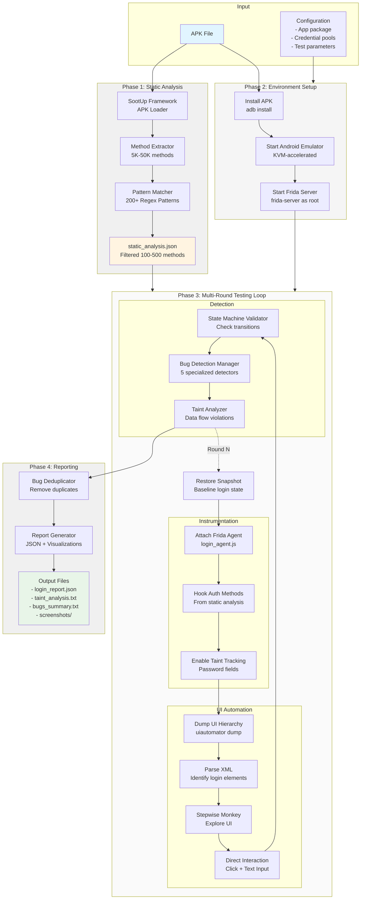

# Android Login Detector - Detailed Workflow Diagrams

## Diagram 1: Complete System Architecture (High-Level)



## Diagram 2: Detailed Per-Round Workflow

```
┌─────────────────────────────────────────────────────────────────────────┐
│                     ROUND N EXECUTION (45-120 seconds)                   │
└─────────────────────────────────────────────────────────────────────────┘

Step 1: Snapshot Restoration (15-30s)
━━━━━━━━━━━━━━━━━━━━━━━━━━━━━━━━━━━━
┌──────────────────────────────────────┐
│  adb shell stop                      │
│  emulator @test_device -snapshot     │
│    snap_baseline -no-snapshot-save  │
│  Wait for boot completion            │
│  Verify app at login screen          │
└──────────────────────────────────────┘
         │
         ▼
Step 2: Frida Attachment (2-5s)
━━━━━━━━━━━━━━━━━━━━━━━━━━━━━━━━━━━━
┌──────────────────────────────────────┐
│  frida -U -n com.example.app         │
│  Load login_agent.js                 │
│  ┌────────────────────────────────┐  │
│  │ Agent receives:                │  │
│  │ - static_analysis.json         │  │
│  │ - regex_patterns.txt           │  │
│  └────────────────────────────────┘  │
│  Hook identified methods:            │
│  ✓ LoginActivity.handleLogin        │
│  ✓ retrofit2.Call.execute            │
│  ✓ okhttp3.Call.execute              │
│  ✓ ... (100-500 methods total)       │
└──────────────────────────────────────┘
         │
         ▼
Step 3: UI Element Detection (2-5s)
━━━━━━━━━━━━━━━━━━━━━━━━━━━━━━━━━━━━
┌──────────────────────────────────────────────────────────────┐
│  adb shell uiautomator dump /sdcard/ui.xml                   │
│  adb pull /sdcard/ui.xml                                     │
│                                                               │
│  Parse XML:                                                  │
│  ┌────────────────────────────────────────────────────────┐ │
│  │ <node class="EditText"                                 │ │
│  │   resource-id="com.example:id/username"                │ │
│  │   bounds="[100,200][500,250]"                          │ │
│  │   hint="Email or username" />                          │ │
│  │                                                         │ │
│  │ <node class="EditText"                                 │ │
│  │   resource-id="com.example:id/password"                │ │
│  │   input-type="129" (PASSWORD)                          │ │
│  │   bounds="[100,300][500,350]" />                       │ │
│  │                                                         │ │
│  │ <node class="Button"                                   │ │
│  │   text="Log In"                                        │ │
│  │   bounds="[150,400][450,480]" />                       │ │
│  └────────────────────────────────────────────────────────┘ │
│                                                               │
│  Extracted Elements:                                         │
│  ✓ Username Field: Center (300, 225)                         │
│  ✓ Password Field: Center (300, 325)                         │
│  ✓ Login Button:   Center (300, 440)                         │
│                                                               │
│  Detect OAuth:                                               │
│  ✓ Google Login Button: (300, 550)                           │
│  ✗ Facebook Login: Not detected                              │
└──────────────────────────────────────────────────────────────┘
         │
         ▼
Step 4: Credential Selection (< 1s)
━━━━━━━━━━━━━━━━━━━━━━━━━━━━━━━━━━━━
┌──────────────────────────────────────┐
│  Detected: Google Login              │
│  ┌────────────────────────────────┐  │
│  │ Use Google Credential Pool:    │  │
│  │ - pools/google_accounts.txt    │  │
│  │ - pools/google_passwords.txt   │  │
│  └────────────────────────────────┘  │
│                                      │
│  Random selection:                   │
│  Username: test.user@gmail.com       │
│  Password: TestPass123!              │
│                                      │
│  Track attempt: Round 5, Pair #12    │
└──────────────────────────────────────┘
         │
         ▼
Step 5: UI Interaction (10-30s)
━━━━━━━━━━━━━━━━━━━━━━━━━━━━━━━━━━━━
┌─────────────────────────────────────────────────────────────┐
│  5.1 Stepwise Monkey Exploration (if needed)                │
│  ┌───────────────────────────────────────────────────────┐  │
│  │ For i = 1 to 100:                                     │  │
│  │   adb shell monkey -p com.example.app --throttle 500  │  │
│  │     --pct-touch 100 1                                 │  │
│  │   If i % 5 == 0:                                      │  │
│  │     Check if login page visible                       │  │
│  │     If yes: Break exploration                         │  │
│  └───────────────────────────────────────────────────────┘  │
│                                                             │
│  5.2 Username Input                                         │
│  ┌───────────────────────────────────────────────────────┐  │
│  │ adb shell input tap 300 225  ← Click username field  │  │
│  │ sleep 500ms                                           │  │
│  │ adb shell input keyevent KEYCODE_DEL (x50)  ← Clear  │  │
│  │ adb shell input text 'test.user@gmail.com'           │  │
│  └───────────────────────────────────────────────────────┘  │
│                                                             │
│  5.3 Password Input                                         │
│  ┌───────────────────────────────────────────────────────┐  │
│  │ adb shell input tap 300 325  ← Click password field  │  │
│  │ sleep 500ms                                           │  │
│  │ adb shell input keyevent KEYCODE_DEL (x50)  ← Clear  │  │
│  │ adb shell input text 'TestPass123!'                  │  │
│  └───────────────────────────────────────────────────────┘  │
│                                                             │
│  5.4 Login Button Click                                     │
│  ┌───────────────────────────────────────────────────────┐  │
│  │ adb shell input tap 300 440  ← Click login button    │  │
│  │ Start timer (T0 = now)                                │  │
│  └───────────────────────────────────────────────────────┘  │
│                                                             │
│  5.5 Wait for Result (10s default timeout)                  │
│  ┌───────────────────────────────────────────────────────┐  │
│  │ Every 1 second:                                       │  │
│  │   Dump UI, check for:                                 │  │
│  │   - Error messages (regex: error|invalid|failed)      │  │
│  │   - Page navigation (activity changed)                │  │
│  │   - Success indicators (main screen visible)          │  │
│  └───────────────────────────────────────────────────────┘  │
└─────────────────────────────────────────────────────────────┘
         │
         ▼
Step 6: Frida Log Collection (< 1s)
━━━━━━━━━━━━━━━━━━━━━━━━━━━━━━━━━━━━
┌─────────────────────────────────────────────────────────────┐
│  Collected logs (JSON lines):                               │
│  ┌───────────────────────────────────────────────────────┐  │
│  │ {"type":"api_call", "timestamp":1736582400123,        │  │
│  │  "class":"LoginActivity", "method":"handleLogin",     │  │
│  │  "args":["test.user@gmail.com", "***"],              │  │
│  │  "state":"Authenticating"}                            │  │
│  │                                                        │  │
│  │ {"type":"taint_marked", "taint_id":"TAINT_PWD_001",  │  │
│  │  "source":"EditText", "field":"password"}             │  │
│  │                                                        │  │
│  │ {"type":"api_call", "timestamp":1736582401456,        │  │
│  │  "class":"retrofit2.OkHttpCall", "method":"execute",  │  │
│  │  "args":["POST","https://api.example.com/login"],     │  │
│  │  "state":"SendingCredentials", "tainted":true}        │  │
│  │                                                        │  │
│  │ {"type":"taint_flow", "taint_id":"TAINT_PWD_001",     │  │
│  │  "sink":"okhttp3.Call.execute", "url":"https://..."}  │  │
│  │                                                        │  │
│  │ {"type":"api_call", "timestamp":1736582403789,        │  │
│  │  "class":"LoginViewModel", "method":"parseResponse",  │  │
│  │  "args":["{\"success\":true,\"token\":\"...\"}"],     │  │
│  │  "state":"ParsingResponse"}                           │  │
│  └───────────────────────────────────────────────────────┘  │
│                                                             │
│  Total API calls: 23                                        │
│  Taint flows: 1                                             │
│  Duration: 3.7 seconds                                      │
└─────────────────────────────────────────────────────────────┘
         │
         ▼
Step 7: State Machine Validation (< 1s)
━━━━━━━━━━━━━━━━━━━━━━━━━━━━━━━━━━━━
┌─────────────────────────────────────────────────────────────┐
│  Reconstruct state sequence:                                │
│  ┌───────────────────────────────────────────────────────┐  │
│  │ Observed: [Authenticating → SendingCredentials →     │  │
│  │            CheckingCredentials → ParsingResponse →    │  │
│  │            LoggedIn_NoMFA]                            │  │
│  └───────────────────────────────────────────────────────┘  │
│                                                             │
│  Validate transitions:                                      │
│  ┌───────────────────────────────────────────────────────┐  │
│  │ Authenticating → SendingCredentials: ✓ Valid         │  │
│  │ SendingCredentials → CheckingCredentials: ✓ Valid    │  │
│  │ CheckingCredentials → ParsingResponse: ✓ Valid       │  │
│  │ ParsingResponse → LoggedIn_NoMFA: ✓ Valid            │  │
│  └───────────────────────────────────────────────────────┘  │
│                                                             │
│  Check required states:                                     │
│  ✓ CheckingCredentials present (verification occurred)      │
│  ✓ No invalid transitions detected                          │
│                                                             │
│  Result: State machine validation PASSED                    │
└─────────────────────────────────────────────────────────────┘
         │
         ▼
Step 8: Bug Detection (2-5s)
━━━━━━━━━━━━━━━━━━━━━━━━━━━━━━━━━━━━
┌─────────────────────────────────────────────────────────────┐
│  Run 5 specialized detectors:                               │
│                                                             │
│  1. CrashDetector                                           │
│  ┌───────────────────────────────────────────────────────┐  │
│  │ Parse logcat for "FATAL EXCEPTION"                    │  │
│  │ Result: No crashes detected                           │  │
│  └───────────────────────────────────────────────────────┘  │
│                                                             │
│  2. LoginTimeoutDetector                                    │
│  ┌───────────────────────────────────────────────────────┐  │
│  │ Elapsed time: 3.7s                                    │  │
│  │ Threshold: 360s                                       │  │
│  │ Result: No timeout                                    │  │
│  └───────────────────────────────────────────────────────┘  │
│                                                             │
│  3. NavigationFlowDetector                                  │
│  ┌───────────────────────────────────────────────────────┐  │
│  │ All transitions valid (from Step 7)                   │  │
│  │ Result: No navigation issues                          │  │
│  └───────────────────────────────────────────────────────┘  │
│                                                             │
│  4. ErrorMessageMismatchDetector                            │
│  ┌───────────────────────────────────────────────────────┐  │
│  │ UI error message: None                                │  │
│  │ HTTP status: 200 OK                                   │  │
│  │ Result: No mismatch                                   │  │
│  └───────────────────────────────────────────────────────┘  │
│                                                             │
│  5. LifecycleDataLossDetector (if round % 3 == 0)           │
│  ┌───────────────────────────────────────────────────────┐  │
│  │ Skipped (not round 3, 6, 9, ...)                      │  │
│  └───────────────────────────────────────────────────────┘  │
│                                                             │
│  Bugs detected this round: 0                                │
└─────────────────────────────────────────────────────────────┘
         │
         ▼
Step 9: Taint Analysis (< 1s)
━━━━━━━━━━━━━━━━━━━━━━━━━━━━━━━━━━━━
┌─────────────────────────────────────────────────────────────┐
│  Collected taints: 1                                        │
│  ┌───────────────────────────────────────────────────────┐  │
│  │ Taint ID: TAINT_PWD_001                               │  │
│  │ Type: password                                        │  │
│  │ Source: EditText (resource-id: password_field)        │  │
│  │ Timestamp: 1736582400789                              │  │
│  └───────────────────────────────────────────────────────┘  │
│                                                             │
│  Collected flows: 1                                         │
│  ┌───────────────────────────────────────────────────────┐  │
│  │ Taint ID: TAINT_PWD_001                               │  │
│  │ Sink: okhttp3.Call.execute                            │  │
│  │ Method: POST https://api.example.com/login            │  │
│  │ Protocol: HTTPS (encrypted)                           │  │
│  └───────────────────────────────────────────────────────┘  │
│                                                             │
│  Validate flow:                                             │
│  ✓ Sink is HTTPS (secure) → No violation                    │
│  ✗ If HTTP → CRITICAL violation                             │
│                                                             │
│  Violations detected: 0                                     │
└─────────────────────────────────────────────────────────────┘
         │
         ▼
Step 10: Per-Round Reporting (< 1s)
━━━━━━━━━━━━━━━━━━━━━━━━━━━━━━━━━━━━
┌─────────────────────────────────────────────────────────────┐
│  Save artifacts:                                            │
│  ┌───────────────────────────────────────────────────────┐  │
│  │ reports/bugs_round_5.txt           (bug details)      │  │
│  │ reports/login_report_round_5.json  (API calls)        │  │
│  │ screenshots/round_5/               (UI snapshots)     │  │
│  │   ├─ baseline.png                                     │  │
│  │   ├─ after_username.png                               │  │
│  │   ├─ after_password.png                               │  │
│  │   └─ after_login.png                                  │  │
│  │ logs/frida_round_5.log             (Frida output)     │  │
│  │ logs/logcat_round_5.txt            (Android logs)     │  │
│  └───────────────────────────────────────────────────────┘  │
│                                                             │
│  Update statistics:                                         │
│  Total attempts: 5                                          │
│  Successful logins: 3                                       │
│  Failed logins: 2                                           │
│  Bugs found (cumulative): 2                                 │
└─────────────────────────────────────────────────────────────┘
         │
         ▼
┌─────────────────────────────────────┐
│  Return to Step 1 for Round N+1     │
│  (or proceed to Final Reporting     │
│   if all rounds complete)           │
└─────────────────────────────────────┘
```

## Diagram 3: Static Analysis Detailed Flow

```
┌──────────────────────────────────────────────────────────────────────┐
│                      STATIC ANALYSIS PHASE                            │
│                        (30-120 seconds)                               │
└──────────────────────────────────────────────────────────────────────┘

Input: com.example.app_1.0.apk (5.2 MB)
   │
   ▼
┌────────────────────────────────────────────────────────────────┐
│ Step 1: APK Loading with SootUp                               │
├────────────────────────────────────────────────────────────────┤
│  ApkAnalysisInputLocation apkLocation =                        │
│    new ApkAnalysisInputLocation(                               │
│      "com.example.app_1.0.apk",                                │
│      androidJar,                                               │
│      SourceType.Application                                    │
│    );                                                          │
│                                                                │
│  JavaView view = new JavaView(apkLocation);                    │
│                                                                │
│  Loaded:                                                       │
│  - Classes: 1,234                                              │
│  - Methods: 8,976                                              │
│  - Fields: 3,456                                               │
└────────────────────────────────────────────────────────────────┘
   │
   ▼
┌────────────────────────────────────────────────────────────────┐
│ Step 2: Method Enumeration                                     │
├────────────────────────────────────────────────────────────────┤
│  For each ClassType in view.getClasses():                      │
│    For each MethodSignature in class.getMethods():             │
│      ┌──────────────────────────────────────────────────────┐ │
│      │ Extract:                                             │ │
│      │ - Class name: com.example.LoginActivity            │ │
│      │ - Method name: handleLogin                          │ │
│      │ - Signature: (Ljava/lang/String;Ljava/lang/String;)V│ │
│      │ - Parameters: [String username, String password]    │ │
│      │ - Return type: void                                 │ │
│      └──────────────────────────────────────────────────────┘ │
│                                                                │
│  Extracted: 8,976 method signatures                            │
└────────────────────────────────────────────────────────────────┘
   │
   ▼
┌────────────────────────────────────────────────────────────────┐
│ Step 3: Pattern Matching (Regex-based)                        │
├────────────────────────────────────────────────────────────────┤
│  Load patterns from regex_patterns.txt:                        │
│  ┌──────────────────────────────────────────────────────────┐ │
│  │ [Authenticating]                                         │ │
│  │ login|signIn|authenticate|authorize|doLogin              │ │
│  │                                                          │ │
│  │ [SendingCredentials]                                     │ │
│  │ retrofit.*execute|okhttp3.*Call\.execute|HttpPost        │ │
│  │                                                          │ │
│  │ [CheckingCredentials]                                    │ │
│  │ verifyCredentials|validateUser|checkPassword             │ │
│  │                                                          │ │
│  │ [ParsingResponse]                                        │ │
│  │ parseLoginResponse|handleAuthResult|onSuccess            │ │
│  └──────────────────────────────────────────────────────────┘ │
│                                                                │
│  For each method:                                              │
│    For each state pattern:                                     │
│      If methodName matches pattern:                            │
│        Add to matches[state]                                   │
│                                                                │
│  Matches found:                                                │
│  - Authenticating: 45 methods                                  │
│  - SendingCredentials: 23 methods                              │
│  - CheckingCredentials: 12 methods                             │
│  - ParsingResponse: 34 methods                                 │
│  - ... (13 more states)                                        │
│                                                                │
│  Total matched: 156 methods (1.7% of total)                    │
└────────────────────────────────────────────────────────────────┘
   │
   ▼
┌────────────────────────────────────────────────────────────────┐
│ Step 4: IR/Jimple Analysis (Fine-grained)                     │
├────────────────────────────────────────────────────────────────┤
│  For suspicious methods (e.g., WebView usage):                 │
│    Get Jimple IR:                                              │
│    ┌──────────────────────────────────────────────────────┐   │
│    │ void loadUrl(String url) {                          │   │
│    │   $r0 := @this: WebView                             │   │
│    │   $r1 := @parameter0: String                        │   │
│    │   virtualinvoke $r0.<WebView: void loadUrl(String)>│   │
│    │     ($r1)                                            │   │
│    │   return                                             │   │
│    │ }                                                    │   │
│    └──────────────────────────────────────────────────────┘   │
│                                                                │
│    Search IR body for keywords:                                │
│    - "authorization:", "Bearer ", "grant_type"                 │
│    - If found → Classify as auth-related                       │
│                                                                │
│  Additional matches from IR: 8 methods                         │
└────────────────────────────────────────────────────────────────┘
   │
   ▼
┌────────────────────────────────────────────────────────────────┐
│ Step 5: JSON Output Generation                                │
├────────────────────────────────────────────────────────────────┤
│  {                                                             │
│    "apkName": "com.example.app_1.0.apk",                       │
│    "analysisTime": "2026-01-11T10:30:45Z",                     │
│    "matches": {                                                │
│      "Authenticating": [                                       │
│        {                                                       │
│          "className": "com.example.LoginActivity",             │
│          "methodName": "handleLogin",                          │
│          "signature": "(String, String)V",                     │
│          "matchedPattern": "login",                            │
│          "confidence": 0.95                                    │
│        },                                                      │
│        ...                                                     │
│      ],                                                        │
│      "SendingCredentials": [...],                              │
│      ...                                                       │
│    },                                                          │
│    "statistics": {                                             │
│      "totalClasses": 1234,                                     │
│      "totalMethods": 8976,                                     │
│      "matchedMethods": 164,                                    │
│      "matchRate": "1.8%",                                      │
│      "processingTime": "87s"                                   │
│    }                                                           │
│  }                                                             │
│                                                                │
│  Save to: reports/static_analysis/com.example.app_1.0.json     │
└────────────────────────────────────────────────────────────────┘
   │
   ▼
Output: static_analysis.json (164 matched methods)
   │
   │ This file is loaded by Frida agent to guide hooking
   ▼
```

## Diagram 4: Bug Detection Decision Tree

```
                    ┌─────────────────────────┐
                    │  Login Attempt Complete │
                    └───────────┬─────────────┘
                                │
                ┌───────────────┴───────────────┐
                │                               │
        ┌───────▼────────┐              ┌──────▼──────┐
        │  Parse Logcat  │              │ Parse Frida │
        │     Output     │              │    Logs     │
        └───────┬────────┘              └──────┬──────┘
                │                              │
    ┌───────────▼───────────┐       ┌─────────▼──────────┐
    │ FATAL EXCEPTION found?│       │ API call sequence  │
    └───────────┬───────────┘       │    extracted       │
                │                   └─────────┬──────────┘
        Yes ┌───┴───┐ No                     │
            │       │                         │
    ┌───────▼───┐   │              ┌─────────▼──────────┐
    │ BUG:      │   │              │ Reconstruct State  │
    │ CRASH     │   │              │     Sequence       │
    │ (CRITICAL)│   │              └─────────┬──────────┘
    └───────────┘   │                        │
                    │              ┌─────────▼──────────┐
                    │              │ Valid transition?  │
                    │              └─────────┬──────────┘
                    │                  Yes   │   No
                    │                        │
                    │              ┌─────────▼──────────┐
                    │              │ BUG:               │
                    │              │ INVALID_TRANSITION │
                    │              │ (HIGH)             │
                    │              └────────────────────┘
                    │
            ┌───────▼────────┐
            │ Elapsed Time > │
            │   Threshold?   │
            └───────┬────────┘
                Yes │   No
                    │
            ┌───────▼───┐
            │ BUG:      │
            │ TIMEOUT   │
            │ (HIGH)    │
            └───────────┘
                    │
            ┌───────▼────────┐
            │ Compare UI     │
            │ Error Message  │
            │ vs HTTP Status │
            └───────┬────────┘
                    │
          ┌─────────▼─────────┐
          │ Mismatch detected?│
          └─────────┬─────────┘
              Yes   │   No
                    │
          ┌─────────▼──────────┐
          │ BUG:               │
          │ MISLEADING_ERROR   │
          │ (MEDIUM)           │
          └────────────────────┘
                    │
          ┌─────────▼─────────┐
          │ Round % 3 == 0?   │
          └─────────┬─────────┘
              Yes   │   No → Skip
                    │
          ┌─────────▼─────────┐
          │ Rotate Device     │
          │ 0° → 90° → 180°   │
          └─────────┬─────────┘
                    │
          ┌─────────▼──────────┐
          │ Credentials lost?  │
          └─────────┬──────────┘
              Yes   │   No
                    │
          ┌─────────▼──────────┐
          │ BUG:               │
          │ LIFECYCLE_DATA_LOSS│
          │ (HIGH)             │
          └────────────────────┘
                    │
          ┌─────────▼─────────┐
          │ Deduplicate Bugs  │
          │ (across rounds)   │
          └─────────┬─────────┘
                    │
          ┌─────────▼─────────┐
          │ Generate Report   │
          │ bugs_round_N.txt  │
          └───────────────────┘
```

## Diagram 5: Taint Tracking Flow

```
┌──────────────────────────────────────────────────────────────────┐
│                    TAINT TRACKING WORKFLOW                        │
└──────────────────────────────────────────────────────────────────┘

Phase 1: Source Marking (Automatic)
━━━━━━━━━━━━━━━━━━━━━━━━━━━━━━━━━━━━
┌────────────────────────────────────────────────────────────┐
│ Frida hooks android.widget.EditText instances:             │
│                                                            │
│ Java.choose("android.widget.EditText", {                   │
│   onMatch: function(instance) {                            │
│     const inputType = instance.getInputType();             │
│                                                            │
│     // Check if password field                             │
│     if (inputType & 0x00000081) { // TYPE_TEXT_PASSWORD    │
│       const taintId = "TAINT_PASSWORD_" + Date.now();      │
│                                                            │
│       TaintStore.addTaint({                                │
│         id: taintId,                                       │
│         type: "password",                                  │
│         source: "EditText",                                │
│         resourceId: instance.getId()                       │
│       });                                                  │
│     }                                                      │
│   }                                                        │
│ });                                                        │
└────────────────────────────────────────────────────────────┘
              │
              ▼
Phase 2: Data Flow Tracking
━━━━━━━━━━━━━━━━━━━━━━━━━━━━━━━━━━━━
┌────────────────────────────────────────────────────────────┐
│ User types password: "MySecretPass123"                     │
│                                                            │
│ Flow 1: EditText.getText()                                 │
│ ┌────────────────────────────────────────────────────────┐ │
│ │ Hook: EditText.getText()                               │ │
│ │ Return value: "MySecretPass123"                        │ │
│ │ Taint: TAINT_PASSWORD_1736582400000                    │ │
│ │ Record: TaintStore.recordFlow(taintId, "getText")     │ │
│ └────────────────────────────────────────────────────────┘ │
│              │                                             │
│              ▼                                             │
│ Flow 2: String passed to login method                      │
│ ┌────────────────────────────────────────────────────────┐ │
│ │ Hook: LoginActivity.handleLogin(username, password)    │ │
│ │ Parameter password: "MySecretPass123"                  │ │
│ │ Taint: TAINT_PASSWORD_1736582400000                    │ │
│ │ Record: TaintStore.recordFlow(taintId, "handleLogin") │ │
│ └────────────────────────────────────────────────────────┘ │
│              │                                             │
│              ▼                                             │
│ Flow 3: String passed to HTTP request builder              │
│ ┌────────────────────────────────────────────────────────┐ │
│ │ Hook: RequestBody.create(mediaType, content)           │ │
│ │ Content contains: "MySecretPass123"                    │ │
│ │ Taint: TAINT_PASSWORD_1736582400000                    │ │
│ │ Record: TaintStore.recordFlow(taintId, "HTTP body")   │ │
│ └────────────────────────────────────────────────────────┘ │
│              │                                             │
│              ▼                                             │
│ Flow 4: HTTP request executed (SINK)                       │
│ ┌────────────────────────────────────────────────────────┐ │
│ │ Hook: okhttp3.Call.execute()                           │ │
│ │ Request URL: https://api.example.com/login             │ │
│ │ Request body contains tainted data                     │ │
│ │ Taint: TAINT_PASSWORD_1736582400000                    │ │
│ │ Protocol: HTTPS ✓                                      │ │
│ │                                                        │ │
│ │ TaintStore.recordSink({                                │ │
│ │   taintId: "TAINT_PASSWORD_1736582400000",             │ │
│ │   sink: "okhttp3.Call.execute",                        │ │
│ │   url: "https://api.example.com/login",                │ │
│ │   protocol: "HTTPS"                                    │ │
│ │ });                                                    │ │
│ └────────────────────────────────────────────────────────┘ │
└────────────────────────────────────────────────────────────┘
              │
              ▼
Phase 3: Violation Detection
━━━━━━━━━━━━━━━━━━━━━━━━━━━━━━━━━━━━
┌────────────────────────────────────────────────────────────┐
│ Check if sink is safe:                                     │
│                                                            │
│ if (protocol == "HTTP") {  // Unencrypted                  │
│   ⚠️  VIOLATION: Password sent over HTTP                   │
│   Severity: CRITICAL                                       │
│ }                                                          │
│ else if (protocol == "HTTPS") {  // Encrypted              │
│   ✓ SAFE: Password sent over HTTPS                         │
│   No violation                                             │
│ }                                                          │
│                                                            │
│ Other unsafe sinks:                                        │
│ - android.util.Log.d() → Password logged to console       │
│ - SharedPreferences.Editor.putString() → Unencrypted      │
│ - FileOutputStream → Written to file                       │
│ - ClipboardManager.setPrimaryClip() → Copied to clipboard │
└────────────────────────────────────────────────────────────┘
              │
              ▼
Phase 4: Report Generation
━━━━━━━━━━━━━━━━━━━━━━━━━━━━━━━━━━━━
┌────────────────────────────────────────────────────────────┐
│ Taint Analysis Report                                      │
│ ━━━━━━━━━━━━━━━━━━━━━━━━━━━━━━━━━━━━━━━━━━━━━━━━━━━━━━━━ │
│                                                            │
│ Summary:                                                   │
│ - Taints marked: 1                                         │
│ - Flows tracked: 4                                         │
│ - Violations found: 0                                      │
│                                                            │
│ Taint Details:                                             │
│ ┌────────────────────────────────────────────────────────┐ │
│ │ Taint ID: TAINT_PASSWORD_1736582400000                 │ │
│ │ Type: password                                         │ │
│ │ Source: EditText (resource-id: password_field)         │ │
│ │ Timestamp: 2026-01-11 10:30:40.000                     │ │
│ │ Value Length: 16 characters                            │ │
│ └────────────────────────────────────────────────────────┘ │
│                                                            │
│ Flow Chain:                                                │
│ ┌────────────────────────────────────────────────────────┐ │
│ │ 1. EditText.getText() (source)                         │ │
│ │ 2. LoginActivity.handleLogin(String, String)           │ │
│ │ 3. RequestBody.create(MediaType, String)               │ │
│ │ 4. okhttp3.Call.execute() (sink)                       │ │
│ │    → URL: https://api.example.com/login                │ │
│ │    → Protocol: HTTPS ✓                                 │ │
│ │    → Status: SAFE                                      │ │
│ └────────────────────────────────────────────────────────┘ │
│                                                            │
│ Violations: None                                           │
│                                                            │
│ ✓ All sensitive data flows are secure                      │
└────────────────────────────────────────────────────────────┘
```

---

## Rendering Instructions

### For LaTeX/Academic Papers:
1. Convert Mermaid diagrams to PDF using `mmdc` (Mermaid CLI)
2. Include ASCII diagrams in `\begin{verbatim}...\end{verbatim}` blocks
3. Use TikZ for custom state machine diagrams

### For Online Documentation:
1. Mermaid diagrams render automatically on GitHub, GitLab, Notion
2. Use Mermaid Live Editor for customization: https://mermaid.live

### For Presentations:
1. Export Mermaid diagrams as PNG/SVG
2. Use Draw.io or Lucidchart for interactive versions
3. Simplify diagrams for slide readability (remove excessive detail)
